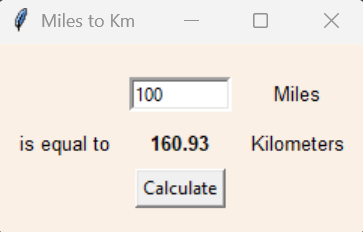

# Miles to Km Converter

A simple Python program that uses Tkinter to convert miles into
kilometers. Type in a number of miles, click \"Calculate,\" and the
result appears in km.

## Features - Easy to read and understand - Basic Tkinter GUI - Instant
miles to km conversion

## How to Run Make sure Python 3 is installed, then run:

\`\`\`bash python converter.py
